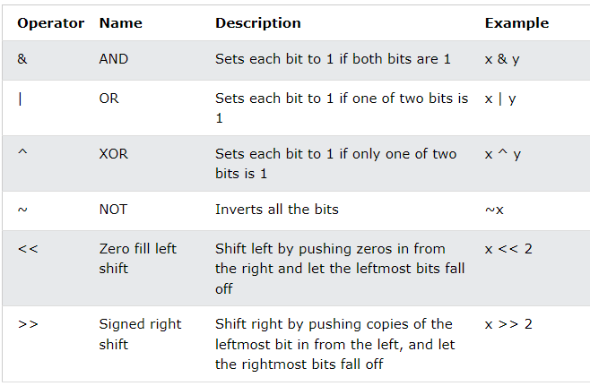

# Operations
E.g. 5 + 2 
* Here '+' is 'operator'
* Here 5 and 2 are 'opearants'
* Here the whole '5+2' system is 'operation'

## Python Operators
Python divides opearters into the following groups:
1. Arithmetic Operators
2. Assignment Operators
3. Comparison Operators
4. Logical Operators
5. Identity Operators
6. Membership Operators
7. Bitwise Operators

## 1. Arithmetic Operators
The arithmetic operators perform addition, subtraction, multiplication, division, exponentiation, and modulus operations.

|   Operator             |Operator Name                          |Example                         |
|----------------|-------------------------------|-----------------------------|
|+|`Addition`            |``` 15+7 ```            |
|-|`Subtraction`            |``` 15-7 ```            |
|*|`Multiplication`            |``` 5*7 ```            |
|/|`Division`            |``` 5/3 ```            |
|%|`Modulus`            |``` 15%7 ```            |
|**|`Exponential`            |``` 5**3 ```            |
|//|`Floor Division`            |``` 15//7 ```            |


*Example* 

```python
print(2 + 7, "Addition")
print(7 - 2, "Subtraction")
print(7 * 2, "Multiplication")
print(7 / 2, "Division")
print(11 % 3, "Modulus") #modulus is the remainder in division
print(2 ** 2, "Exponent")
print(7 // 2, "Floor division") #it only tells value before point.
```

Output:
```markup
9 Addition
5 Subtraction
14 Multiplication
3.5 Division
2 Modulus
4 Exponent
3 Floor division
```

## 2. Assignement Operators
Assignment operators are used to assign values to variables.    


 </div>

*Example*  

```python
a = 7
print(a)
b = 2
print(b)
```

Output:
```markup
7
2
```

## 3. Comparison Operators
It tells whether the statement is True or False.

|   Operator             |Operator Name                          |Example                         |
|----------------|-------------------------------|-----------------------------|
|==|`Equal`            |``` 7==7 ```            |
|!=|`Not equal`            |``` 15!=7 ```            |
|>|`Greater than`            |``` 15>7 ```            |
|<|`Less than`            |``` 15<7 ```            |
|>=|`Greater than or equal to`            |``` x>=y ```            |
|<=|`Less than or equal to`            |``` x<=y ```            |

---

## Equalto:

```python
# Example#1
a = 7
b = 7
print(a == b)

# Example#2
c = 7
d = 9
print(c == d)
```

Output:
```markup
True
False
```

## Greaterthan / Less than:
```python
# Example#3
a = 7
b = 9
print(a > b)

# Example#4
c = 7
d = 9
print(c < d)
```

Output:
```markup
False
True
```

## Greater than or equal to / Less than  or equal to:
```python
# Example#5
a = 10
b = 9
print(a >= b)

# Example#6
c = 9
d = 9
print(c <= d)
```

Output:
```markup
True
True
```

## Not equal to:
```python
# Example#7
a = 9
b = 9
print(a != b)
```

Output:
```markup
False
```

## 4. Logical Operators
Logical operators are used to combine conditional statements:

|   Operator             |Operator Name                          |Example                         |
|----------------|-------------------------------|-----------------------------|
|and|`Returns True if both statements are true`            |``` x<5 and x<10 ```            |
|or|`Returns True if one of the statements is true`            |``` x<5 or x<4 ```            |
|not|`Reverse the result, returns False if the result is true`            |``` not(x<5 and x<10)```            |

## 'and' operator:

*Example#1* 

```python
 #      1        2        3       4
print(True and True and True and True)
print(True and False and True and True)
print(True and False and True and False)
print(False and False and False and False)
```

Output:
```markup:
True
False
False
False
```

*Example#2*
```python
x = 5
print(x > 3 and x < 10)
# returns True because 5 is greater than 3 AND 5 is less than 10
```

Output:
```
True
```

## 'or' operator:

*Example#1* 

```python
 #      1        2        3       4
print(True or True or True or True)
print(True or False or True or True)
print(True or False or True or False)
print(False or False or True or False)
print(False or False or False or False)
```

Output:
```markup:
True
True
True
True
False
```

*Example#2* 

```python
x = 5
print(x > 3 or x < 4)
# returns True because one of the conditions are true (5 is greater than 3, but 5 is not less than 4)
```

Output:
```
True
```

## 'not' operator:

*Example* 

```python
x = 5
print(not(x > 3 and x < 10))
# returns False because not is used to reverse the result
```

Output:
```
False
```

## 5. Identity Operators
Identity operators are used to compare the objects, not if they are equal, but if they are actually the same object, with the same memory location:

|   Operator             |Description                           |Example                         |
|----------------|-------------------------------|-----------------------------|
|is|`Returns True if both variables are the same object`            |``` x is y ```            |
|is not|`Returns True if both variables are not the same object`            |``` x is not y ```            |

## 'is' operator:

*Example*

```python
x = ["apple", "banana"]
y = ["apple", "banana"]
z = x

print(x is z)
# returns True because z is the same object as x

print(x is y)
# returns False because x is not the same object as y, even if they have the same content

print(x == y)
# to demonstrate the difference betweeen "is" and "==": this comparison returns True because x is equal to y
```

Output:
```
True
False
True
```

## 'is not' operator:

*Example*

```python
x = ["apple", "banana"]
y = ["apple", "banana"]
z = x

print(x is not z)
# returns False because z is the same object as x

print(x is not y)
# returns True because x is not the same object as y, even if they have the same content

print(x != y)
# to demonstrate the difference betweeen "is not" and "!=": this comparison returns False because x is equal to y
```

Output:
```
False
True
False
```

## 6. Membership Operators
Membership operators are used to test if a sequence is presented in an object:

|   Operator             |Description                           |Example                         |
|----------------|-------------------------------|-----------------------------|
|in|`Returns True if a sequence with the specified value is present in the object`            |``` x in y ```            |
|not in|`Returns True if a sequence with the specified value is not present in the object`            |``` x not in y ```            |

## 'in' operator:

*Example*
```python
x = ["apple", "banana"]
print("banana" in x)
# returns True because a sequence with the value "banana" is in the list
```

Output:
```
True
```

## 'not in' operator:

*Example*

```python
x = ["apple", "banana"]
print("pineapple" not in x)
# returns True because a sequence with the value "pineapple" is not in the list
```

Output:
```
True
```

## 7. Bitwise Operators:
Bitwise operators are used to compare (binary) numbers:

    
 </div>