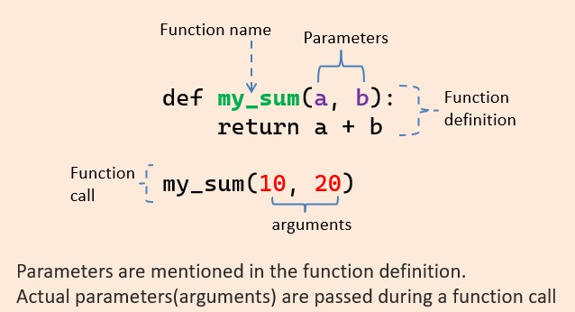
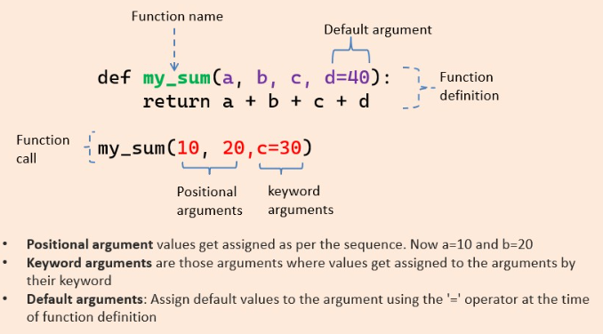

# Arguments
Information can be passed into functions as arguments.\
Arguments are specified after the function name, inside the parentheses. You can add as many arguments as you want, just separate them with a comma.

*Example* :
```python
def my_function(fname):   #here fname = argument
  print(fname + " Refsnes")

my_function("Emil")
my_function("Tobias")
my_function("Linus")
```

Output:
```
Emil Refsnes
Tobias Refsnes
Linus Refsnes
```

## Parameters or Arguments?
The terms parameter and argument can be used for the same thing: information that are passed into a function.
* Parameters are the variables that we specify inside parentheses at the time of defining a function. 
* Arguments, on the other hand, are the values that are passed for these parameters when calling the function

*Example* :
* Here num1 and num2 are 'parameters'.
* And, 5,6 are 'arguments'
```python 
def add_two_num(num1, num2):
    sum = num1 + num2
    return sum
 
sum = add_two_num(5, 6)  # num1 = 5, num2 = 6
print(sum)
```

Output:
```
11
```
---


---

## Number of Arguments
By default, a function must be called with the correct number of arguments. Meaning that if your function expects 2 arguments, you have to call the function with 2 arguments, not more, and not less.

*Example* :\
This function expects 2 arguments, and gets 2 arguments:
```python
def my_function(fname, lname):
  print(fname + " " + lname)

my_function("Emil", "Refsnes")
```

Output:
```
Emil Refsnes
```

* If you try to call the function with 1 or 3 arguments, you will get an error:\
```python
def my_function(fname, lname):
  print(fname + " " + lname)

my_function("Emil")
```

Output:
```
This function expects 2 arguments, but gets only 1, thats why it gets an error.
Error
```

## Types of Function Arguments in Python
There are four inherent function argument types in Python, using which we can call functions to perform their desired tasks. These are as follows:

1. Python Default Arguments
2. Python Keyword Arguments (named arguments)
3. Python Required Arguments (Positional arguments)
4. Python Arbitrary Arguments (variable-length arguments *args and **kwargs)




## Default Arguments in Python:
Python Program arguments can have default values. We assign a default value to an argument using the assignment operator in python(=).

*Example* :
* Default argument without return function:
```python
def print_details(name="Elon Musk", age=50):
    print(f"{name} is {age} years old.")
 
print_details("Jeff Bezos", 57)  # Output: Jeff Bezos is 57 years old.
print_details()  # Line 4- Output: Elon Musk is 50 years old.
```

Output:
```
Jeff Bezos is 57 years old.
Elon Musk is 50 years old.
```

## Keyword Arguments in Python:
With keyword arguments in python, we can change the order of passing the arguments without any consequences.

*Example 01* :
```python
def divide_two(a, b):
    res = a / b
    return res  #return function
 
res = divide_two(12, 3)
print(res)  # Output: 4
```

Output:
```
4.0
```
=========================================================
*Example 02* :
```python
# both keyword arguments
res = divide_two(a=3, b=12)  
print(res)  # Output: 0.25
 
# one positional, one keyword argument
res2 = divide_two(36, b=12)
print(res2)  # Output: 3
 
# both keyword arguments, order changed
res3 = divide_two(b=12, a=48)
print(res3)  # Output: 4
```

Output:
```
0.25
3.0
4.0
```

## Required Arguments in Python:
Required arguments, as the name suggests, are those that are required to be passed to the function at the time of function call. 

*Example 01* :
```python
def add_nums(num1, num2=12):
    print(num1 + num2)
 
add_nums(num1=11, num2=13)  # Output: 24
 
# no value for default argument
add_nums(num1=11)  # Output: 23 
 
# no value for required argument
#add_nums(num2=13) # Will throw an error
```

Output:
```
24
23
```

## Arbitary Arguments in Python:
Arbitrary arguments, also known as 'variable length arguments'.

There are two ways to pass variable-length arguments to a python function.
* The first method is by using the single-asterisk (*) symbol. It returns the position base thing.
* The second method is by using the double-asterisk (**) operator. It returns the key values. 

*Example's* :
* By using single-asterisk (*) symbol:
```python
def print_animals(*animals):
    for animal in animals:
        print(animal)
 
print_animals("Lion", "Elephant", "Wolf", "Gorilla")
```

Output:
```
Lion
Elephant
Wolf
Gorilla
```
---
* By using double-asterisk (**) operator:
```python
def print_food(**foods):
    for food in foods.items():
        print(food)
 
print_food(Lion="Carnivore", Elephant="Herbivore", Gorilla="Omnivore")
```

Output:
```
('Lion', 'Carnivore')
('Elephant', 'Herbivore')
('Gorilla', 'Omnivore')
```
---
* By using double-asterisk (**) operator:
```python
# function with variable-length keyword arguments
def percentage(**kwargs):
    sum = 0
    for sub in kwargs:
        # get argument name
        sub_name = sub
        # get argument value
        sub_marks = kwargs[sub]
        print(sub_name, "=", sub_marks)

# pass multiple keyword arguments
percentage(math=56, english=61, science=73)
```

Output:
```
math = 56
english = 61
science = 73
```
---
* The function can also have a combination of arbitrary keyword and non-keyword arguments, i.e. combination of single-asterisk (*) symbol and double-asterisk (**) operator.
```python
def print_animal_details(*animals, **foods):
    for animal in animals:
        print(animal)
    for food in foods.items():
        print(food)
 
print_animal_details("Lion", "Elephant", "Wolf", "Gorilla", 
                    Lion="Carnivore", Elephant="Herbivore", Gorilla="Omnivore")
```

Output:
```
Lion
Elephant
Wolf
Gorilla
('Lion', 'Carnivore')
('Elephant', 'Herbivore')
('Gorilla', 'Omnivore')
```