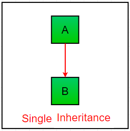
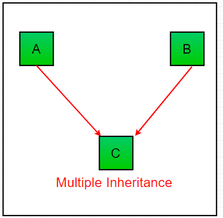
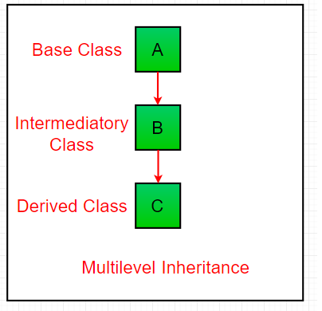
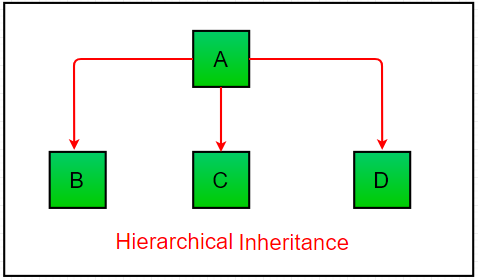
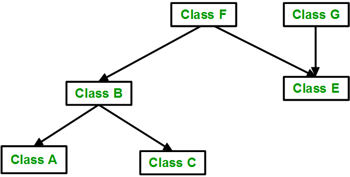

# Types of Inheritance:
Types of Inheritance depend upon the number of child and parent classes involved. There are four types of inheritance in Python:

## Single Inheritance:
Single inheritance enables a derived class to inherit properties from a single parent class, thus enabling code reusability and the addition of new features to existing code.



---

*Example*:
```python
# single inheritance
 
class Parent:  # Base class
    def func1(self):
        print("This function is in parent class.")
  
class Child(Parent): # Derived class
    def func2(self):
        print("This function is in child class.")
 
 
# Driver's code
object = Child()
object.func1()
object.func2()
```

Output:
```
This function is in parent class.
This function is in child class.
```

## Multiple Inheritance: 
When a class can be derived from more than one base class this type of inheritance is called multiple inheritances. In multiple inheritances, all the features of the base classes are inherited into the derived class. 



---
*Example 01*:
```python
class Base1:
    def method1(self):
        print("Base1 method")

class Base2:
    def method2(self):
        print("Base2 method")

class Derived(Base1, Base2):
    def method3(self):
        print("Derived method")

d = Derived()
d.method1()
d.method2()
d.method3()
```

Output:
```
Base1 method
Base2 method
Derived method
```

========================================================
*Example 02* :
```python
# multiple inheritance
 
class Mother: # Base class1
    mothername = ""
 
    def mother(self):
        print(self.mothername)
  
class Father:  # Base class2
    fathername = ""
 
    def father(self):
        print(self.fathername) 
 
class Son(Mother, Father): # Derived class
    def parents(self):
        print("Father :", self.fathername)
        print("Mother :", self.mothername)
 
 
# Driver's code
s1 = Son()
s1.fathername = "Ali"
s1.mothername = "Sara"
s1.parents()
```

Output:
```
Father : Ali
Mother : Sara
```

## Multilevel Inheritance :
In multilevel inheritance, features of the base class and the derived class are further inherited into the new derived class. This is similar to a relationship representing a child and a grandfather. 



---
*Example 01*:
```python
class Employees():
    def Name(self):
        print("Employee Name: Khush")

class salary(Employees):
    def Salary(self):
        print("Salary: 10000")

class Designation(salary):
    def desig(self):
        print("Designation: Test Engineer")

call = Designation()
call.Name()
call.Salary()
call.desig()
```

Output:
```
Employee Name: Khush
Salary: 10000
Designation: Test Engineer
```

========================================================
*Example 02* :
```python
# multilevel inheritance
 
class Grandfather: # Base class
    def __init__(self, grandfathername):
        self.grandfathername = grandfathername
  
class Father(Grandfather): # Intermediate class
    def __init__(self, fathername, grandfathername):
        self.fathername = fathername
 
        # invoking constructor of Grandfather class
        Grandfather.__init__(self, grandfathername)
  
class Son(Father): # Derived class
    def __init__(self, sonname, fathername, grandfathername):
        self.sonname = sonname
 
        # invoking constructor of Father class
        Father.__init__(self, fathername, grandfathername)
 
    def print_name(self):
        print('Grandfather name :', self.grandfathername)
        print("Father name :", self.fathername)
        print("Son name :", self.sonname)
 
#  Driver code
s1 = Son('Prince', 'Harry', 'Ali')
print(s1.grandfathername)
s1.print_name()
```

Output:
```
Ali
Grandfather name : Ali
Father name : Harry
Son name : Prince
```

## Hierarchical Inheritance: 
When more than one derived class are created from a single base this type of inheritance is called hierarchical inheritance. In this program, we have a parent (base) class and two child (derived) classes.



---
*Example 01* :
```python
# Hierarchical inheritance

class Parent: # Base class
    def func1(self):
        print("This function is in parent class.")
  
class Child1(Parent): # Derived class1
    def func2(self):
        print("This function is in child 1.")
  
class Child2(Parent): # Derivied class2
    def func3(self):
        print("This function is in child 2.")
 
 
# Driver's code
object1 = Child1()
object1.func1()
object1.func2()

object2 = Child2()
object2.func1()
object2.func3()
```

Output:
```
This function is in parent class.
This function is in child 1.
This function is in parent class.
This function is in child 2.
```
========================================================
*Example 02* :
```python
class Animal():
    def animal(self):
        print("I'm an Animal")

class Cat(Animal):
    def cat(self):
        print("I'm a cat Meow Meow!")

class Dog(Animal):
    def dog(self):
        print("I'm a dog Brak Bark!")

cat = Cat()
dog = Dog()

print("Cat")
cat.animal()
cat.cat()

print("\nDog")
dog.animal()
dog.dog()
```

Output:
```
Cat
I'm an Animal
I'm a cat Meow Meow!

Dog
I'm an Animal
I'm a dog Brak Bark!
```
Note: In this example, we have a base class Animal with a function, and two child classes, Cat and Dog, that inherit from the Animal class. The child classes can access the properties of the Animal class, such as the animal() function. In this case, each animal has its own unique behavior `(cat() and dog() functions)`, but they also share common characteristics defined in the `Animal` class 


## Hybrid Inheritance: 
Inheritance consisting of multiple types of inheritance is called hybrid inheritance.



---

*Example 01* :
```python
# hybrid inheritance
 
class School:
    def func1(self):
        print("This function is in school.")
 
class Student1(School):
    def func2(self):
        print("This function is in student 1. ")
 
class Student2(School):
    def func3(self):
        print("This function is in student 2.") 
 
class Student3(Student1, School):
    def func4(self):
        print("This function is in student 3.")
 
# Driver's code
object = Student3()
object.func1()
object.func2()
```

Output:
```
This function is in school.
This function is in student 1.
```

========================================================
*Example 02* :
```python
class GrandFather():
    def grandFather(self):
        print("I'm Baron, the father of your father")

class Father(GrandFather):
    def father(self):
        print("I'm John, your father")

class SonTom(Father):
    def tom(self):
        print("Hey! I'm Tom")

class SonBob(Father):
    def bob(self):
        print("Hey! I'm Bob")

class DaughterJenny(Father):
    def jenny(self):
        print("Hey! I'm Jenny")

tom = SonTom()
bob = SonBob()
jenny = DaughterJenny()

print("Tom")
tom.tom()
tom.father()
tom.grandFather()

print("\nBob")
bob.bob()
bob.father()
bob.grandFather()

print("\nJenny")
jenny.jenny()
jenny.father()
jenny.grandFather()
```

Output:
```
Tom
Hey! I'm Tom
I'm John, your father
I'm Baron, the father of your father

Bob
Hey! I'm Bob
I'm John, your father
I'm Baron, the father of your father

Jenny
Hey! I'm Jenny
I'm John, your father
I'm Baron, the father of your father
```

Note: In this example, we have a base class `GrandFather` and a derived class `Father` that inherits from `GrandFather`. Furthermore, there are three more derived classes: `SonTom`, `SonBob`, and `DaughterJenny`, which inherit from the Father class. The `Father` class acts as a bridge, allowing the derived classes to access the functions and properties of both the `Father` and `GrandFather` classes.